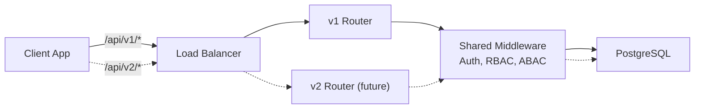
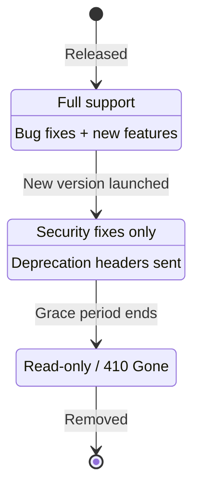
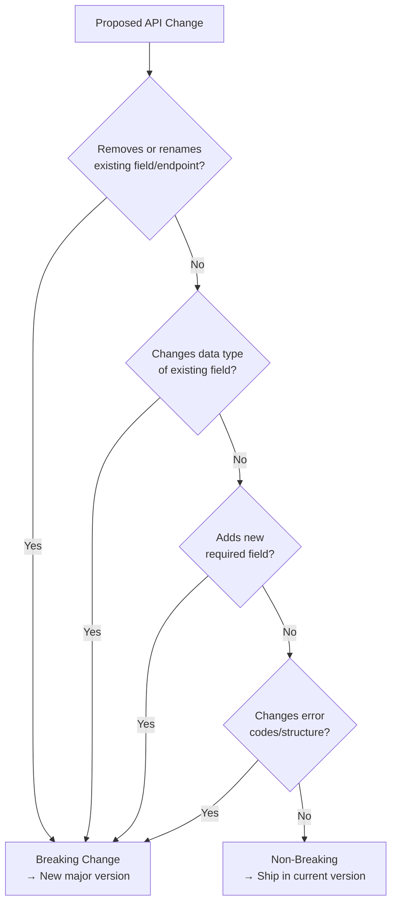

# MedEase API Versioning Strategy

**Version:** 1.0
**Last Updated:** 2026-03-07
**Status:** Active

## Table of Contents
1. [Overview](#overview)
2. [Versioning Scheme](#versioning-scheme)
3. [Current API Structure](#current-api-structure)
4. [Version Lifecycle](#version-lifecycle)
5. [Backwards Compatibility Policy](#backwards-compatibility-policy)
6. [Breaking vs Non-Breaking Changes](#breaking-vs-non-breaking-changes)
7. [Deprecation Process](#deprecation-process)
8. [Client Migration Guide](#client-migration-guide)
9. [Response Envelope](#response-envelope)

---

## Overview

MedEase uses **URI path versioning** for its REST API. This document defines how API versions are introduced, maintained, deprecated, and retired, along with our backwards compatibility guarantees.

---

## Versioning Scheme

### Strategy: URI Path Prefix

```
https://api.medease.com/api/v{major}/{resource}
```

| Component | Description | Example |
|-----------|-------------|---------|
| Base URL | Environment-specific host | `http://localhost:5001` |
| API prefix | Fixed namespace | `/api` |
| Version | Major version number | `/v1` |
| Resource | Endpoint path | `/patients`, `/appointments` |

**Full example:** `GET http://localhost:5001/api/v1/appointments`

### Why URI Path Versioning

| Approach | Pros | Cons | Chosen |
|----------|------|------|--------|
| URI path (`/v1/`) | Explicit, easy to route, cacheable | URL changes between versions | Yes |
| Header (`Accept-Version`) | Clean URLs | Hidden, harder to test/debug | No |
| Query param (`?v=1`) | Simple | Harder to cache, easily forgotten | No |

URI path was chosen because:
- It is immediately visible in logs, browser dev tools, and documentation
- Load balancers and API gateways can route by path without inspecting headers
- Healthcare compliance auditing benefits from explicit version trails

### Version Numbering

Versions follow **major-only** numbering (`v1`, `v2`, `v3`). Minor and patch changes are absorbed within the current version under our backwards compatibility policy.

```
v1  -- current stable version
v2  -- next version (introduced only when breaking changes are required)
```

---

## Current API Structure

### v1 Endpoints (Current)

```
/api/v1
  /auth
    POST   /login
    POST   /register
    POST   /refresh
    POST   /logout
    GET    /me/permissions

  /patients
    GET    /
    GET    /:id
    GET    /:id/history
    GET    /:id/prescriptions

  /doctors
    GET    /
    GET    /:id

  /appointments
    GET    /
    GET    /:id
    POST   /
    PATCH  /:id
    DELETE /:id

  /medical-records
    GET    /
    GET    /:id
    POST   /
    PATCH  /:id

  /prescriptions
    GET    /
    GET    /:id
    POST   /
    PATCH  /:id

  /lab-reports
    GET    /

  /roles
    GET    /
    GET    /:id
    POST   /
    PATCH  /:id
    DELETE /:id
    GET    /permissions
    GET    /users/:id/roles
    POST   /users/:id/roles
    DELETE /users/:id/roles/:roleId

  /admin
    GET    /users
    GET    /audit-logs

  /dashboard
    GET    /stats

  /abac-policies
    GET    /
    GET    /:id
    POST   /
    PATCH  /:id
    DELETE /:id
```

### Architecture



### Frontend Client Configuration

The frontend API client uses a single configurable base URL and appends `/api` automatically:

```js
// Environment variable
VITE_API_URL=http://localhost:5001

// Requests are made as:
// GET ${VITE_API_URL}/api/v1/appointments
```

When a new API version is introduced, the frontend can target it by updating the version in the request helper without changing every call site.

---

## Version Lifecycle

Each API version passes through four stages:



| Stage | Duration | Support Level | Response Header |
|-------|----------|---------------|-----------------|
| **Active** | Ongoing | Full: bug fixes, features, security patches | -- |
| **Deprecated** | 6 months minimum | Security and critical bug fixes only | `Deprecation: true` |
| **Sunset** | 3 months | Responses return `410 Gone` | `Sunset: <date>` |
| **Retired** | -- | Endpoint removed | -- |

### Concurrent Version Support

At most **two** major versions will be supported at the same time. When `v3` enters Active, `v1` must have already been retired.

```
Timeline:
  v1  ████████████████░░░░░░▒▒▒▒
  v2            ████████████████░░░░░░▒▒▒▒
  v3                      ████████████████

  ████ Active   ░░░░ Deprecated   ▒▒▒▒ Sunset
```

---

## Backwards Compatibility Policy

### Guarantee

Within a major version, all changes are **backwards compatible**. Existing clients must continue to work without modification.

### What We Guarantee (Within a Version)

| Guarantee | Description |
|-----------|-------------|
| Existing fields are never removed | A field present in a response today will remain |
| Existing fields keep their type | A `string` field will not become a `number` |
| Existing endpoints keep working | A `GET /patients` will not become `POST /patients` |
| Existing error codes are stable | `401`, `403`, `404` meanings don't change |
| Required request fields stay the same | We won't add new required fields to existing endpoints |

### What We May Do (Non-Breaking)

| Change | Example | Why It's Safe |
|--------|---------|---------------|
| Add new optional response fields | Add `middleName` to patient | Clients ignore unknown fields |
| Add new optional request fields | Add `?sortBy=date` query param | Existing requests unaffected |
| Add new endpoints | `GET /api/v1/notifications` | No impact on existing endpoints |
| Add new enum values | New appointment `status` value | Clients should handle unknown values |
| Relax validation | Accept both `+94` and `0` phone prefix | Strictly more permissive |
| Improve error messages | Clearer wording in `message` field | Clients should not parse message text |

---

## Breaking vs Non-Breaking Changes

### Non-Breaking (Ship in Current Version)

- Adding new endpoints
- Adding optional query parameters
- Adding optional request body fields
- Adding new response fields
- Widening accepted input values
- Adding new webhook event types

### Breaking (Requires New Version)

- Removing or renaming an endpoint
- Removing or renaming a response field
- Changing a field's data type
- Adding a new required request field
- Changing authentication mechanism
- Changing error response structure
- Altering pagination behavior
- Changing the meaning of an existing field

### Decision Flowchart



---

## Deprecation Process

When a new API version is released, the previous version enters deprecation:

### Step 1: Announce (Day 0)

- Update this document with deprecation date
- Add `Deprecation` and `Sunset` headers to all responses from the old version
- Notify clients via changelog and in-app notification

```http
HTTP/1.1 200 OK
Deprecation: true
Sunset: Sat, 07 Sep 2026 00:00:00 GMT
Link: <https://docs.medease.com/api/v2/migration>; rel="successor-version"
```

### Step 2: Grace Period (6 months)

- Old version continues to work
- Only security and critical fixes are backported
- Deprecation warning logged server-side for monitoring adoption

### Step 3: Sunset (3 months)

- Old version returns `410 Gone` with migration link
- Server logs track remaining callers

```json
{
  "status": "error",
  "statusCode": 410,
  "message": "API v1 has been retired. Please migrate to v2.",
  "migrationGuide": "https://docs.medease.com/api/v2/migration"
}
```

### Step 4: Retire

- Route handler removed from codebase
- Old version tests archived

---

## Client Migration Guide

### Frontend Migration

When a new API version is released:

1. **Update the API service layer** - change the version prefix in the `request()` helper:

```js
// Before
fetch(`${API_URL}/api/v1${endpoint}`, { ... });

// After
fetch(`${API_URL}/api/v2${endpoint}`, { ... });
```

2. **Handle renamed/restructured fields** in response mappers
3. **Test all pages** against the new version
4. **Deploy frontend update** - since the frontend and backend are independently deployable, both versions remain available during rollout

### Third-Party Client Migration

For any future external integrations:

1. Subscribe to the API changelog
2. Test against the new version using the provided migration guide
3. Update client code within the 6-month deprecation window
4. Verify no `Deprecation` headers in responses after migration

---

## Response Envelope

All API responses follow a consistent envelope format across versions:

### Success Response

```json
{
  "status": "success",
  "data": { ... }
}
```

### Error Response

```json
{
  "status": "error",
  "statusCode": 400,
  "message": "Human-readable error description"
}
```

### Pagination (List Endpoints)

```json
{
  "status": "success",
  "data": [ ... ],
  "pagination": {
    "page": 1,
    "limit": 20,
    "total": 142,
    "totalPages": 8
  }
}
```

### Envelope Stability

The top-level envelope (`status`, `data`, `message`, `statusCode`) is version-independent and will not change between API versions. Only the contents of `data` are subject to versioned changes.

---

## Implementation Notes

### Adding a New Version

When the time comes to introduce `v2`:

```
backend/src/routes/
  index.js          ← mounts /v1 and /v2
  v1/
    index.js        ← current routes (moved here)
    auth.routes.js
    ...
  v2/
    index.js        ← new version routes
    auth.routes.js
    ...
```

```js
// routes/index.js
const v1Routes = require('./v1');
const v2Routes = require('./v2');

router.use('/v1', v1Routes);
router.use('/v2', v2Routes);
```

Shared middleware (authentication, RBAC, ABAC, error handling) remains version-independent and is reused across versions. Only route handlers and response mappers are versioned.

### Health Check

The `/health` endpoint is unversioned and always available at the root:

```
GET /health
```

This ensures monitoring tools work regardless of API version changes.
