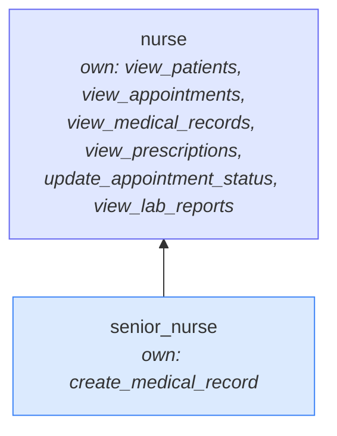
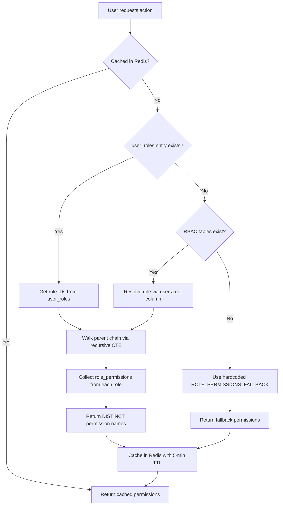
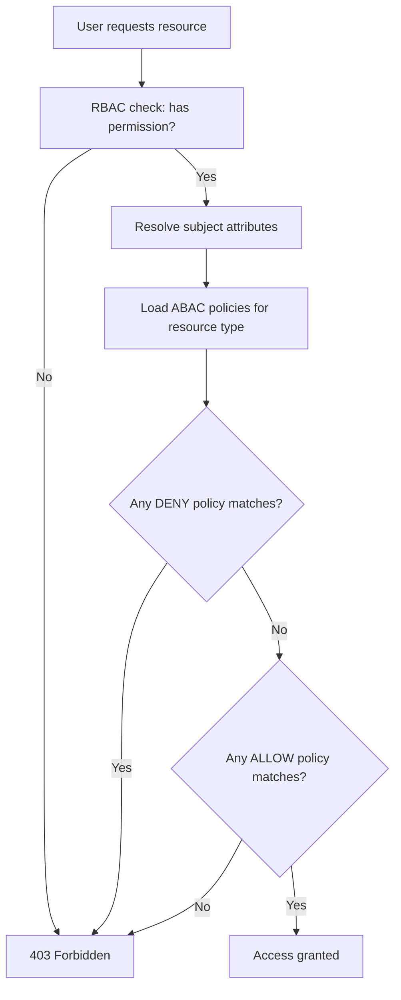
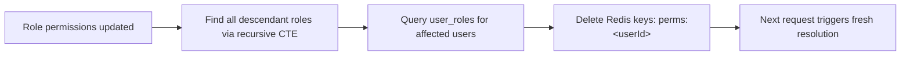
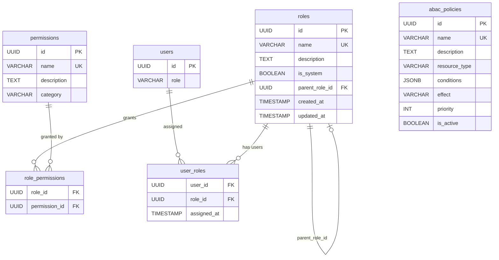

# Access Control Policies (RBAC + ABAC)

This document describes the access control system used in MedEase. It covers role-based permissions (RBAC), attribute-based policies (ABAC), role hierarchy, and permission resolution.

## Table of Contents

- [Overview](#overview)
- [Permissions](#permissions)
- [System Roles](#system-roles)
- [Role Hierarchy](#role-hierarchy)
- [Permission Resolution](#permission-resolution)
- [Attribute-Based Access Control (ABAC)](#attribute-based-access-control-abac)
- [Caching](#caching)
- [Frontend Permission System](#frontend-permission-system)
- [Permission Management UI](#permission-management-ui)

---

## Overview

MedEase uses a granular permission system layered on top of named roles. Each **permission** represents a single action (e.g. `view_patients`, `create_prescription`). Permissions are grouped into **roles**, and roles are assigned to users. Roles support **single-parent inheritance**, so a child role automatically inherits all permissions from its parent chain.

Key properties:

- 26 permissions across 6 categories
- 6 system roles (cannot be deleted or renamed)
- Custom roles can be created, edited, and deleted by admins
- Single-parent hierarchy with cycle detection
- Redis-cached permission lookups with 5-minute TTL

---

## Permissions

### Patients

| Permission | Description |
|---|---|
| `view_patients` | View patient list and profiles |
| `view_own_profile` | View own patient profile |
| `edit_own_profile` | Edit own patient profile |
| `edit_patient` | Edit any patient profile |

### Appointments

| Permission | Description |
|---|---|
| `view_appointments` | View all appointments |
| `view_own_appointments` | View own appointments |
| `create_appointment` | Create new appointments |
| `cancel_appointment` | Cancel appointments |
| `update_appointment_status` | Update appointment status |

### Medical Records

| Permission | Description |
|---|---|
| `view_medical_records` | View all medical records |
| `view_own_medical_records` | View own medical records |
| `create_medical_record` | Create medical records |
| `edit_medical_record` | Edit medical records |

### Prescriptions

| Permission | Description |
|---|---|
| `view_prescriptions` | View all prescriptions |
| `view_own_prescriptions` | View own prescriptions |
| `create_prescription` | Create prescriptions |
| `dispense_prescription` | Dispense prescriptions |
| `cancel_prescription` | Cancel prescriptions |

### Lab Reports

| Permission | Description |
|---|---|
| `view_lab_reports` | View all lab reports |
| `view_own_lab_reports` | View own lab reports |
| `create_lab_report` | Create lab reports |
| `edit_lab_report` | Edit lab reports |

### Admin

| Permission | Description |
|---|---|
| `manage_users` | Activate/deactivate user accounts |
| `manage_roles` | Create and assign roles and permissions |
| `view_audit_logs` | View system audit logs |
| `view_dashboard` | View admin dashboard and analytics |

---

## System Roles

System roles are seeded at database initialization. They have `is_system = true` and cannot be deleted. Their names cannot be changed, but their permissions can be modified by admins.

### Admin

Full access to all 26 permissions.

### Doctor

| Category | Permissions |
|---|---|
| Patients | `view_patients`, `edit_patient` |
| Appointments | `view_appointments`, `create_appointment`, `cancel_appointment`, `update_appointment_status` |
| Medical Records | `view_medical_records`, `create_medical_record`, `edit_medical_record` |
| Prescriptions | `view_prescriptions`, `create_prescription`, `cancel_prescription` |
| Lab Reports | `view_lab_reports` |

### Nurse

| Category | Permissions |
|---|---|
| Patients | `view_patients` |
| Appointments | `view_appointments`, `update_appointment_status` |
| Medical Records | `view_medical_records` |
| Prescriptions | `view_prescriptions` |
| Lab Reports | `view_lab_reports` |

### Patient

| Category | Permissions |
|---|---|
| Patients | `view_own_profile`, `edit_own_profile` |
| Appointments | `view_own_appointments`, `create_appointment`, `cancel_appointment` |
| Medical Records | `view_own_medical_records` |
| Prescriptions | `view_own_prescriptions` |
| Lab Reports | `view_own_lab_reports` |

### Lab Technician

| Category | Permissions |
|---|---|
| Patients | `view_patients` |
| Lab Reports | `view_lab_reports`, `create_lab_report`, `edit_lab_report` |

### Pharmacist

| Category | Permissions |
|---|---|
| Patients | `view_patients` |
| Prescriptions | `view_prescriptions`, `dispense_prescription` |

---

## Role Hierarchy

Roles support single-parent inheritance via the `parent_role_id` column on the `roles` table.

### How it works

- A role can optionally have one **parent role**.
- A child role inherits all permissions from its parent, grandparent, and so on up the chain.
- Own (direct) permissions and inherited permissions are combined — the effective permission set is the union of both.
- Inherited permissions are resolved at query time using a recursive CTE.

### Constraints

- A role cannot be its own parent.
- Circular hierarchies are rejected. Before setting a parent, the system walks up from the proposed parent to verify the current role does not appear in the ancestor chain.
- Deleting a parent role sets `parent_role_id` to `NULL` on child roles (`ON DELETE SET NULL`).

### Example

If `senior_nurse` has parent `nurse`, and `nurse` has permissions `[view_patients, view_appointments]`, then `senior_nurse` inherits those permissions in addition to any directly assigned to it.



**Effective permissions for `senior_nurse`:** all nurse permissions + `create_medical_record`.

---

## Permission Resolution

When a permission check is needed, the system resolves the user's effective permissions through this flow:



### Fallback behavior

1. **No `user_roles` entry**: Falls back to resolving via the legacy `users.role` column by joining `roles.name = users.role::text`, then walking the hierarchy.
2. **RBAC tables don't exist**: Falls back to a hardcoded `ROLE_PERMISSIONS_FALLBACK` map that mirrors the default seed assignments. This allows the app to function before database migrations run.

### Implementation

The core query in `backend/src/utils/permissions.js`:

```sql
WITH RECURSIVE role_chain AS (
  SELECT ur.role_id FROM user_roles ur WHERE ur.user_id = $1
  UNION
  SELECT r.parent_role_id FROM roles r
  JOIN role_chain rc ON rc.role_id = r.id
  WHERE r.parent_role_id IS NOT NULL
)
SELECT DISTINCT p.name
FROM role_chain rc
JOIN role_permissions rp ON rp.role_id = rc.role_id
JOIN permissions p ON p.id = rp.permission_id
```

---

## Attribute-Based Access Control (ABAC)

ABAC adds fine-grained, resource-level access control on top of RBAC. While RBAC answers "does this user have the permission to view medical records?", ABAC answers "can this user view **this specific** medical record?"

### How it works

ABAC policies are stored in the `abac_policies` table. Each policy targets a **resource type** and defines **conditions** that must match for access to be granted or denied.



### Subject Attributes

Resolved automatically by the `resolveSubject` middleware and cached in Redis:

| Attribute | Source | Description |
|---|---|---|
| `subject.id` | JWT token | User UUID |
| `subject.role` | JWT token | User role (admin, doctor, patient, etc.) |
| `subject.patientId` | `patients` table | Patient profile UUID (if role is patient) |
| `subject.doctorId` | `doctors` table | Doctor profile UUID (if role is doctor) |
| `subject.nurseId` | `nurses` table | Nurse profile UUID (if role is nurse) |
| `subject.pharmacistId` | `pharmacists` table | Pharmacist profile UUID (if role is pharmacist) |

### Resource Attributes

Fetched from the database record being accessed. Any column on the resource table is available as `resource.<column_name>`:

| Resource Type | Key Attributes |
|---|---|
| `appointment` | `patient_id`, `doctor_id`, `status` |
| `medical_record` | `patient_id`, `doctor_id` |
| `prescription` | `patient_id`, `doctor_id`, `status` |
| `lab_report` | `patient_id`, `technician_id` |
| `patient` | `user_id` |

### Condition Language

Policies use a JSON condition language with logical combinators and comparison operators:

```json
{
  "any": [
    { "subject.role": { "in": ["admin", "nurse"] } },
    {
      "all": [
        { "subject.role": { "equals": "doctor" } },
        { "resource.doctor_id": { "equals_ref": "subject.doctorId" } }
      ]
    },
    { "resource.patient_id": { "equals_ref": "subject.patientId" } }
  ]
}
```

**Combinators:**

| Combinator | Behavior |
|---|---|
| `any` | OR — at least one child must be true |
| `all` | AND — every child must be true |

**Operators:**

| Operator | Description | Example |
|---|---|---|
| `equals` | Exact value match | `{ "subject.role": { "equals": "admin" } }` |
| `not_equals` | Not equal | `{ "resource.status": { "not_equals": "cancelled" } }` |
| `in` | Value in list | `{ "subject.role": { "in": ["admin", "nurse"] } }` |
| `not_in` | Value not in list | `{ "subject.role": { "not_in": ["patient"] } }` |
| `equals_ref` | Match against another attribute | `{ "resource.doctor_id": { "equals_ref": "subject.doctorId" } }` |
| `exists` | Attribute is non-null (true) or null (false) | `{ "resource.technician_id": { "exists": true } }` |

### Policy Evaluation

1. **Deny-first**: Deny policies (highest priority first) are evaluated before allow policies
2. **Any-match allow**: At least one allow policy must match for access to be granted
3. **No policies = unrestricted**: If no policies exist for a resource type, access is allowed (RBAC still applies)

### Default Policies

The system seeds sensible default policies:

| Resource | Policy | Effect |
|---|---|---|
| Appointments | Admins and nurses see all | allow |
| Appointments | Patients see own (patient_id match) | allow |
| Appointments | Doctors see own (doctor_id match) | allow |
| Medical Records | Admins and nurses see all | allow |
| Medical Records | Patients see own | allow |
| Medical Records | Doctors see records they created | allow |
| Prescriptions | Admins see all | allow |
| Prescriptions | Pharmacists see all | allow |
| Prescriptions | Patients see own | allow |
| Prescriptions | Doctors see prescriptions they created | allow |
| Lab Reports | Admins and doctors see all | allow |
| Lab Reports | Patients see own | allow |
| Lab Reports | Technicians see reports they created | allow |
| Patients | Admins, doctors, nurses see all | allow |
| Patients | Patients see own profile | allow |

### How ABAC is Applied

**List endpoints** (e.g. `GET /appointments`): The ABAC engine converts policies into SQL WHERE clauses using `buildAccessFilter()`, so filtering happens at the database level.

**Single-resource endpoints** (e.g. `GET /patients/:id`): The `checkResourceAccess` middleware fetches the resource, evaluates all policies against it, and returns 403 if no allow policy matches.

---

## Caching

Three types of data are cached in Redis with a 5-minute TTL:

| Cache Key | Contents |
|---|---|
| `perms:<userId>` | Resolved RBAC permission names for a user |
| `subject:<userId>` | Subject attributes (patientId, doctorId, etc.) |
| `abac:policies` | All active ABAC policies |

### RBAC Cache Invalidation

RBAC permission cache is invalidated when:

- A role's permissions are updated (via `updateRole`)
- A role is deleted (via `deleteRole`)
- A role is assigned to or removed from a user (`assignRoleToUser`, `removeRoleFromUser`)

When a role's permissions change, the system invalidates caches for **all users assigned to that role and all descendant roles**:



The descendant query:

```sql
WITH RECURSIVE descendants AS (
  SELECT id FROM roles WHERE id = $1
  UNION
  SELECT r.id FROM roles r
  JOIN descendants d ON r.parent_role_id = d.id
)
SELECT DISTINCT ur.user_id FROM user_roles ur
JOIN descendants d ON ur.role_id = d.id
```

### ABAC Cache Invalidation

- **Policy cache** (`abac:policies`): Invalidated whenever an ABAC policy is created, updated, or deleted
- **Subject cache** (`subject:<userId>`): Invalidated when user profile data changes

---

## Frontend Permission System

The frontend provides three mechanisms for permission-based rendering and access control.

### `usePermissions` Hook

Returns the current user's permissions and helper functions.

```jsx
const { permissions, can, canAll, canAny, loading } = usePermissions();

if (can('create_prescription')) {
  // show prescribe button
}
```

| Function | Description |
|---|---|
| `can(permission)` | Check a single permission |
| `canAll([...permissions])` | Check that the user has every listed permission |
| `canAny([...permissions])` | Check that the user has at least one listed permission |

### `Can` Component

Conditionally renders children based on permissions.

```jsx
<Can permission="edit_patient">
  <EditButton />
</Can>
```

### `RoleGuard` Component

Wraps routes to restrict access by role. Used in `App.jsx` route definitions.

```jsx
<Route path="permissions" element={
  <RoleGuard roles={['admin']}>
    <PermissionManagement />
  </RoleGuard>
} />
```

---

## Permission Management UI

Available at `/permissions` (admin only). Provides two tabs:

### Roles & Permissions Tab

- Viewing all roles with hierarchy indentation
- Creating custom roles with optional parent selection
- Editing role permissions via category-grouped checkboxes
- Viewing inherited permissions (shown as non-editable with visual distinction)
- Setting/changing parent roles with cycle-safe dropdown
- Deleting custom roles

### Access Policies (ABAC) Tab

- Viewing all ABAC policies grouped by resource type
- Creating new policies with name, resource type, effect, priority, and JSON conditions
- Editing existing policy conditions and metadata
- Toggling policies active/inactive without deleting
- Deleting policies
- Human-readable condition summary for each policy

---

## Database Schema



---

## Audit Trail

All role and permission changes are recorded in the audit log:

| Action | Trigger |
|---|---|
| `CREATE_ROLE` | New role created |
| `UPDATE_ROLE` | Role permissions, name, description, or parent changed |
| `DELETE_ROLE` | Custom role deleted |
| `ASSIGN_ROLE` | Role assigned to a user |
| `REMOVE_ROLE` | Role removed from a user |
| `CREATE_ABAC_POLICY` | New ABAC policy created |
| `UPDATE_ABAC_POLICY` | ABAC policy conditions, effect, or priority changed |
| `DELETE_ABAC_POLICY` | ABAC policy deleted |
