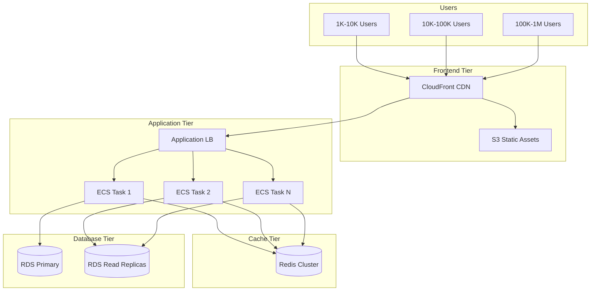
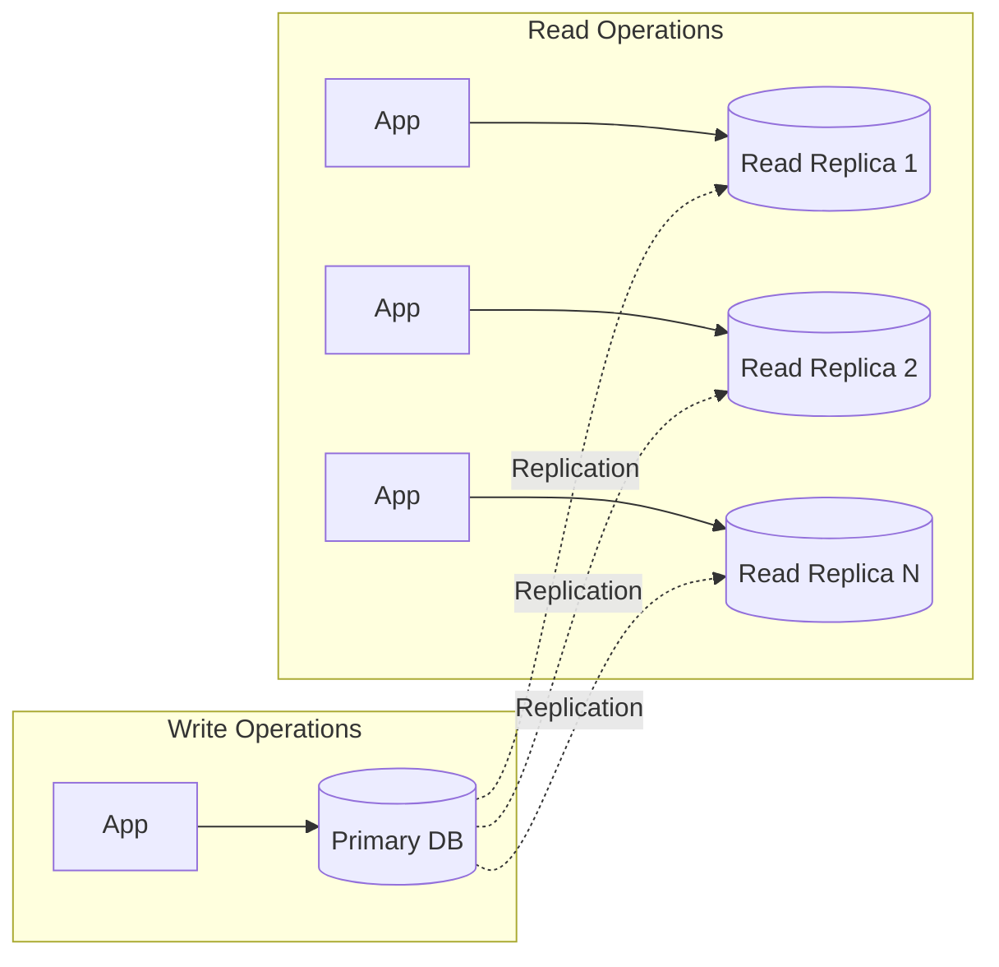
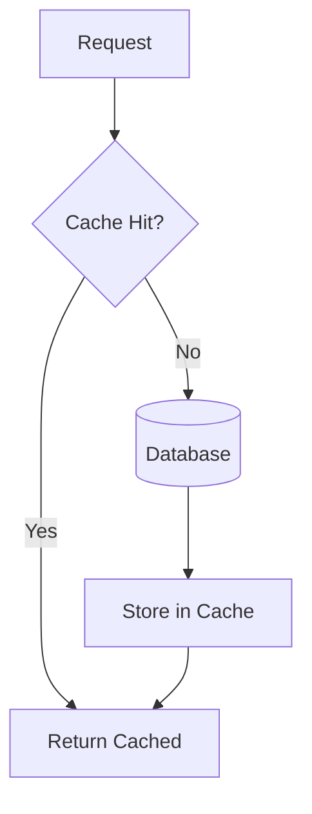
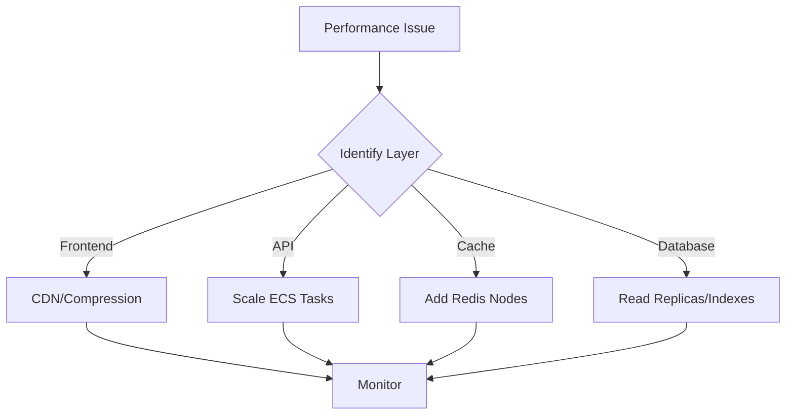

# MedEase Scalability Strategy

**Version:** 1.0
**Last Updated:** 2026-02-04

## Overview

This document outlines the scalability strategy for MedEase to handle growth from 1K to 1M+ concurrent users while maintaining sub-200ms response times and 99.9% uptime.

---

## Current Architecture



---

## Scaling Strategy

### 1. Horizontal Scaling (Primary Strategy)

**Application Layer:**
```yaml
# ECS Auto Scaling
TargetCPUUtilization: 70%
TargetMemoryUtilization: 80%
MinTasks: 2
MaxTasks: 50
ScaleOutCooldown: 60s
ScaleInCooldown: 300s
```

**Benefits:**
- Linear cost scaling
- No downtime during scaling
- Fault tolerance through redundancy

### 2. Database Scaling



**Strategy:**
- **Read Replicas**: 3-5 replicas for read-heavy workloads
- **Connection Pooling**: Max 100 connections per service
- **Query Optimization**: Index all foreign keys and frequent queries
- **Partitioning**: Partition by organization_id for large tables

```sql
-- Example: Partition patients table by organization
CREATE TABLE patients_org_1 PARTITION OF patients
  FOR VALUES IN ('org-uuid-1');

CREATE TABLE patients_org_2 PARTITION OF patients
  FOR VALUES IN ('org-uuid-2');
```

### 3. Caching Strategy



**Redis Cache Layers:**

| Data Type | TTL | Invalidation |
|-----------|-----|--------------|
| User sessions | 12 hours | On logout |
| User permissions | 15 minutes | On role change |
| Patient list | 5 minutes | On patient update |
| Static config | 1 hour | On config change |
| API responses | 30 seconds | Time-based |

**Implementation:**
```javascript
// Cache-aside pattern
const getPatient = async (patientId) => {
  const cacheKey = `patient:${patientId}`;

  // Try cache first
  let patient = await redis.get(cacheKey);
  if (patient) return JSON.parse(patient);

  // Cache miss - fetch from DB
  patient = await db.patients.findByPk(patientId);

  // Store in cache
  await redis.setex(cacheKey, 300, JSON.stringify(patient));

  return patient;
};
```

### 4. CDN & Static Assets

**CloudFront Configuration:**
```yaml
CacheBehaviors:
  - PathPattern: "/static/*"
    TTL: 31536000  # 1 year
    Compress: true

  - PathPattern: "/api/*"
    TTL: 0  # No caching for API
    ForwardHeaders: ["Authorization"]

  - PathPattern: "*.js"
    TTL: 86400  # 1 day
    Compress: true
```

**Performance Gains:**
- 95% reduction in origin requests
- 50-100ms faster load times globally
- $500-1000/month cost savings

---

## Auto-Scaling Configuration

### ECS Service Auto Scaling

```hcl
resource "aws_appautoscaling_target" "ecs" {
  max_capacity       = 50
  min_capacity       = 2
  resource_id        = "service/medease-cluster/medease-backend"
  scalable_dimension = "ecs:service:DesiredCount"
  service_namespace  = "ecs"
}

# CPU-based scaling
resource "aws_appautoscaling_policy" "cpu" {
  name               = "cpu-autoscaling"
  policy_type        = "TargetTrackingScaling"
  resource_id        = aws_appautoscaling_target.ecs.resource_id
  scalable_dimension = aws_appautoscaling_target.ecs.scalable_dimension
  service_namespace  = aws_appautoscaling_target.ecs.service_namespace

  target_tracking_scaling_policy_configuration {
    target_value       = 70.0
    predefined_metric_specification {
      predefined_metric_type = "ECSServiceAverageCPUUtilization"
    }
    scale_in_cooldown  = 300
    scale_out_cooldown = 60
  }
}

# Memory-based scaling
resource "aws_appautoscaling_policy" "memory" {
  name               = "memory-autoscaling"
  policy_type        = "TargetTrackingScaling"
  resource_id        = aws_appautoscaling_target.ecs.resource_id
  scalable_dimension = aws_appautoscaling_target.ecs.scalable_dimension
  service_namespace  = aws_appautoscaling_target.ecs.service_namespace

  target_tracking_scaling_policy_configuration {
    target_value       = 80.0
    predefined_metric_specification {
      predefined_metric_type = "ECSServiceAverageMemoryUtilization"
    }
  }
}
```

### RDS Auto Scaling

```hcl
resource "aws_appautoscaling_target" "rds" {
  max_capacity       = 5
  min_capacity       = 1
  resource_id        = "cluster:medease-aurora-cluster"
  scalable_dimension = "rds:cluster:ReadReplicaCount"
  service_namespace  = "rds"
}

resource "aws_appautoscaling_policy" "rds" {
  name               = "rds-read-replica-autoscaling"
  policy_type        = "TargetTrackingScaling"
  resource_id        = aws_appautoscaling_target.rds.resource_id
  scalable_dimension = aws_appautoscaling_target.rds.scalable_dimension
  service_namespace  = aws_appautoscaling_target.rds.service_namespace

  target_tracking_scaling_policy_configuration {
    target_value       = 75.0
    predefined_metric_specification {
      predefined_metric_type = "RDSReaderAverageCPUUtilization"
    }
  }
}
```

---

## Performance Optimization

### 1. Database Query Optimization

```sql
-- Add indexes for common queries
CREATE INDEX idx_patients_org_id ON patients(organization_id);
CREATE INDEX idx_appointments_doctor_date ON appointments(doctor_id, appointment_date);
CREATE INDEX idx_medical_records_patient ON medical_records(patient_id, created_at DESC);

-- Use EXPLAIN ANALYZE to identify slow queries
EXPLAIN ANALYZE
SELECT * FROM patients WHERE organization_id = 'uuid';
```

### 2. Connection Pooling

```javascript
// PostgreSQL connection pool
const pool = new Pool({
  max: 20,  // Max connections per instance
  min: 5,   // Min connections to maintain
  idleTimeoutMillis: 30000,
  connectionTimeoutMillis: 2000,
});

// Reuse connections
const client = await pool.connect();
try {
  const result = await client.query('SELECT * FROM patients WHERE id = $1', [id]);
  return result.rows[0];
} finally {
  client.release();
}
```

### 3. API Response Compression

```javascript
const compression = require('compression');

app.use(compression({
  threshold: 1024,  // Only compress responses > 1KB
  level: 6          // Balance between speed and compression ratio
}));
```

### 4. Pagination & Lazy Loading

```javascript
// Cursor-based pagination (better than offset)
const getPatients = async (cursor, limit = 20) => {
  const query = `
    SELECT * FROM patients
    WHERE created_at < $1
    ORDER BY created_at DESC
    LIMIT $2
  `;

  const patients = await db.query(query, [cursor || new Date(), limit]);

  return {
    data: patients.rows,
    nextCursor: patients.rows[patients.rows.length - 1]?.created_at,
    hasMore: patients.rows.length === limit
  };
};
```

---

## Capacity Planning

### Growth Projections

| Metric | Current | 6 Months | 12 Months |
|--------|---------|----------|-----------|
| **Users** | 1K | 10K | 50K |
| **Requests/sec** | 50 | 500 | 2,500 |
| **Database Size** | 10 GB | 100 GB | 500 GB |
| **Monthly Cost** | $200 | $800 | $3,000 |

### Resource Requirements

**Per 10K Active Users:**
- ECS Tasks: 5 tasks (2 vCPU, 4GB RAM each)
- RDS: 1 read replica
- Redis: 1 node (cache.r6g.large)
- Bandwidth: ~500 GB/month

### Cost Breakdown (10K users)

| Service | Monthly Cost |
|---------|--------------|
| ECS Fargate (5 tasks) | $180 |
| RDS (db.t4g.large + 1 replica) | $250 |
| Redis (cache.r6g.large) | $120 |
| ALB | $25 |
| CloudFront + S3 | $50 |
| **Total** | **~$625** |

---

## Monitoring & Metrics

### Key Performance Indicators

```yaml
# Response Time
p50: < 100ms
p95: < 200ms
p99: < 500ms

# Throughput
requests_per_second: 100-2000

# Error Rate
5xx_errors: < 0.1%
4xx_errors: < 1%

# Availability
uptime: > 99.9% (43 minutes downtime/month)

# Resource Utilization
cpu_usage: 60-80%
memory_usage: 70-85%
database_connections: < 80% of max
```

### CloudWatch Alarms

```hcl
resource "aws_cloudwatch_metric_alarm" "high_cpu" {
  alarm_name          = "ecs-high-cpu"
  comparison_operator = "GreaterThanThreshold"
  evaluation_periods  = "2"
  metric_name         = "CPUUtilization"
  namespace           = "AWS/ECS"
  period              = "60"
  statistic           = "Average"
  threshold           = "80"
  alarm_actions       = [aws_sns_topic.alerts.arn]
}

resource "aws_cloudwatch_metric_alarm" "high_response_time" {
  alarm_name          = "alb-high-response-time"
  comparison_operator = "GreaterThanThreshold"
  evaluation_periods  = "2"
  metric_name         = "TargetResponseTime"
  namespace           = "AWS/ApplicationELB"
  period              = "60"
  statistic           = "Average"
  threshold           = "0.5"  # 500ms
  alarm_actions       = [aws_sns_topic.alerts.arn]
}
```

---

## Load Testing

### Test Scenarios

```yaml
# Scenario 1: Normal Load
users: 1000
duration: 10m
ramp_up: 2m
requests_per_second: 100

# Scenario 2: Peak Load
users: 5000
duration: 10m
ramp_up: 5m
requests_per_second: 500

# Scenario 3: Stress Test
users: 10000
duration: 10m
ramp_up: 5m
requests_per_second: 1000
```

### Using k6 for Load Testing

```javascript
import http from 'k6/http';
import { check, sleep } from 'k6';

export const options = {
  stages: [
    { duration: '2m', target: 100 },   // Ramp up
    { duration: '5m', target: 1000 },  // Stay at peak
    { duration: '2m', target: 0 },     // Ramp down
  ],
  thresholds: {
    http_req_duration: ['p(95)<200'],  // 95% under 200ms
    http_req_failed: ['rate<0.01'],    // < 1% errors
  },
};

export default function () {
  const res = http.get('https://api.medease.com/patients');
  check(res, {
    'status is 200': (r) => r.status === 200,
    'response time < 200ms': (r) => r.timings.duration < 200,
  });
  sleep(1);
}
```

---

## Bottleneck Resolution

### Common Bottlenecks



**Resolution Matrix:**

| Symptom | Likely Cause | Solution |
|---------|--------------|----------|
| High API latency | CPU throttling | Scale out ECS tasks |
| Slow queries | Missing indexes | Add database indexes |
| High memory usage | Memory leak | Review application code |
| Cache misses | Short TTL | Increase cache TTL |
| Connection errors | Pool exhausted | Increase connection pool |

---

## Migration Strategy

### Phase 1: Current State (1K-10K users)
- Single region deployment
- 2-3 ECS tasks
- 1 RDS primary + 1 read replica
- Basic caching

### Phase 2: Growth (10K-50K users)
- Multi-AZ deployment
- 5-10 ECS tasks with auto-scaling
- 2-3 read replicas
- Redis cluster (3 nodes)
- CloudFront for all static assets

### Phase 3: Scale (50K-100K users)
- Multi-region deployment (US-EAST, US-WEST)
- 10-20 ECS tasks per region
- Aurora Serverless v2 for auto-scaling DB
- Redis cluster (5 nodes)
- Database sharding by organization

### Phase 4: Enterprise (100K+ users)
- Global multi-region deployment
- Event-driven architecture with SQS
- Microservices architecture
- Database sharding + read replicas
- Dedicated Redis clusters per region
- Advanced monitoring with DataDog/New Relic

---

## Summary

MedEase's scalability strategy focuses on:

- **Horizontal scaling** for application and database tiers
- **Aggressive caching** with Redis at multiple layers
- **Auto-scaling** based on CPU, memory, and custom metrics
- **Performance optimization** through indexing, pooling, and compression
- **Proactive monitoring** with CloudWatch alarms and dashboards
- **Cost-effective scaling** using Reserved Instances and Spot capacity

**Target Performance:**
- Support 1M+ concurrent users
- Maintain <200ms p95 response time
- Achieve 99.9% uptime
- Keep costs predictable and linear

---

**Version:** 1.0
**Review Schedule:** Quarterly
**Next Review:** 2026-05-04
