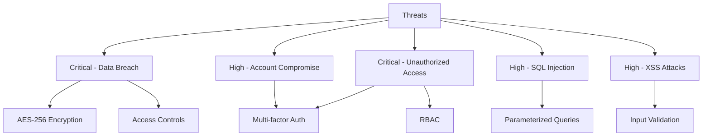
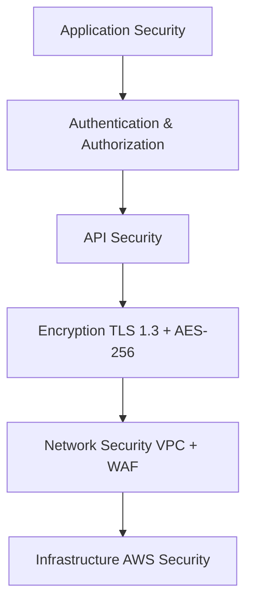
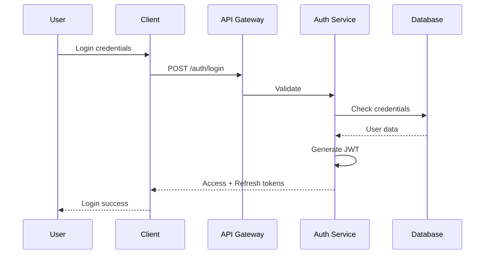
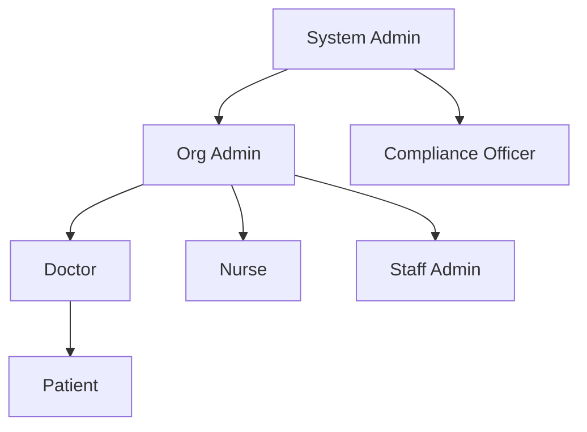
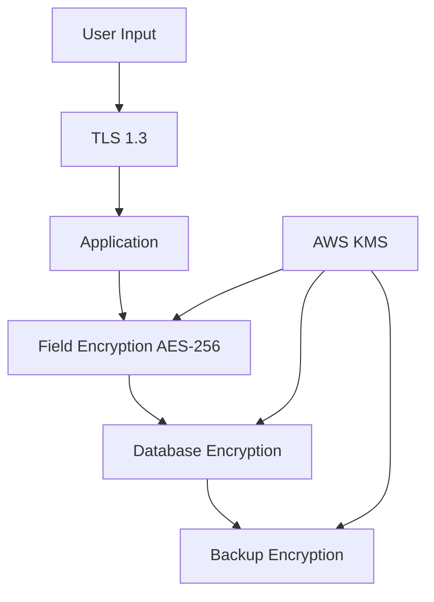
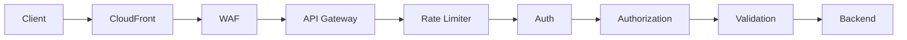
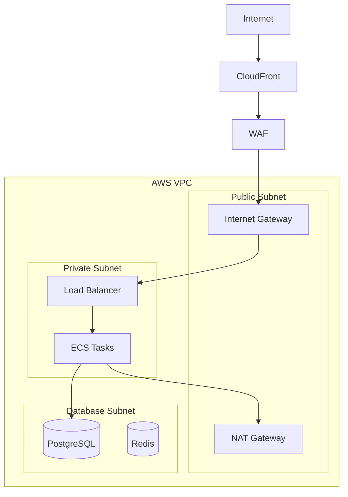
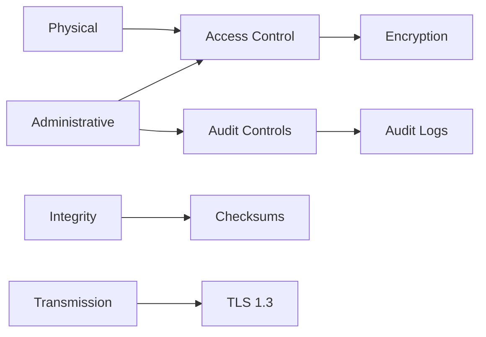
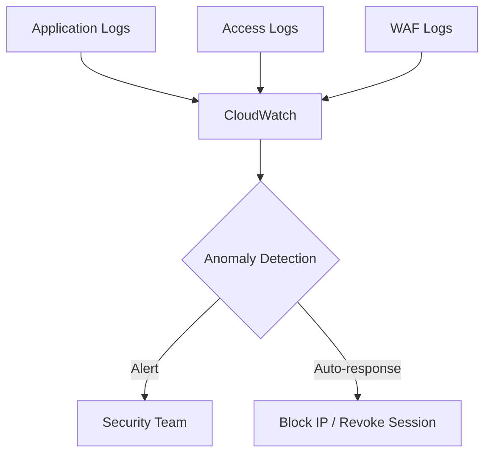
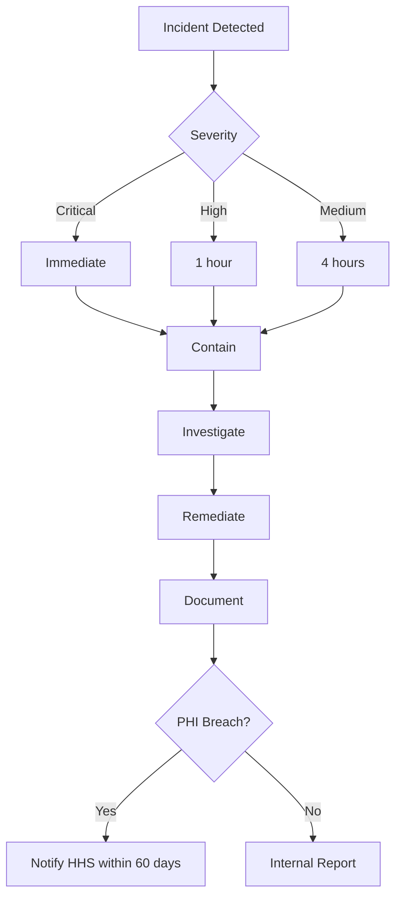

# MedEase Security Architecture

**Version:** 1.0
**Last Updated:** 2026-02-04
**Status:** Production Ready

## Table of Contents
1. [Executive Summary](#executive-summary)
2. [Authentication](#authentication)
3. [Authorization & RBAC](#authorization--rbac)
4. [Data Protection](#data-protection)
5. [API Security](#api-security)
6. [Network Security](#network-security)
7. [Database Security](#database-security)
8. [HIPAA Compliance](#hipaa-compliance)
9. [Monitoring & Incident Response](#monitoring--incident-response)

---

## Executive Summary

MedEase is a healthcare platform handling Protected Health Information (PHI). This document outlines our comprehensive security architecture ensuring HIPAA compliance and data protection.

### Security Objectives
- **Confidentiality**: PHI accessible only to authorized users
- **Integrity**: Prevent unauthorized data modification
- **Availability**: 99.9% uptime with disaster recovery
- **Compliance**: Meet HIPAA requirements
- **Auditability**: Complete audit trail of all PHI access

### Threat Model



### Defense in Depth



---

## Authentication

### Authentication Flow



### JWT Tokens

**Access Token:**
- Lifetime: 15 minutes
- Algorithm: RS256
- Storage: httpOnly cookie

**Refresh Token:**
- Lifetime: 7 days
- Rotation: New token on each use
- Storage: Encrypted in database

```json
{
  "sub": "user-uuid",
  "email": "user@example.com",
  "role": "doctor",
  "permissions": ["read:patients", "write:patients"],
  "organizationId": "org-uuid",
  "exp": 1707048900
}
```

### Multi-Factor Authentication

**Supported Methods:**
- TOTP (Google Authenticator, Authy)
- SMS OTP (backup)
- Backup codes (10 one-time use)

**Security:**
- Required for: Admin, Doctor roles
- Rate limit: 5 attempts per 15 minutes
- Account lockout after 5 failed attempts

### Session Management
- Concurrent sessions: Max 5 per user
- Idle timeout: 30 minutes
- Absolute timeout: 12 hours
- Revocation: On password change or suspicious activity

### Password Requirements
- Minimum 12 characters
- Mix of uppercase, lowercase, numbers, special characters
- Bcrypt hashing (12 rounds)
- Password history (prevent last 5 reuse)
- No common passwords

---

## Authorization & RBAC

### Role Hierarchy



### Permission Model

Format: `<action>:<resource>:<scope>`

Examples:
- `read:patients:own` - Read own records
- `write:patients:assigned` - Write assigned records
- `delete:users:all` - Delete any user (admin only)

### Role Definitions

| Role | Key Permissions | MFA | Timeout |
|------|----------------|-----|---------|
| System Admin | `admin:*:all` | Yes | 30 min |
| Org Admin | `admin:org:own` | Yes | 60 min |
| Doctor | `read:patients:assigned`, `write:medical_records:assigned` | Yes | 60 min |
| Nurse | `read:patients:assigned`, `write:vitals:assigned` | No | 60 min |
| Patient | `read:patients:own` | No | 120 min |

### Database Schema

```sql
CREATE TABLE roles (
  id UUID PRIMARY KEY,
  name VARCHAR(50) UNIQUE NOT NULL,
  permissions JSONB NOT NULL,
  created_at TIMESTAMP DEFAULT NOW()
);

CREATE TABLE user_roles (
  id UUID PRIMARY KEY,
  user_id UUID REFERENCES users(id) ON DELETE CASCADE,
  role_id UUID REFERENCES roles(id),
  organization_id UUID REFERENCES organizations(id),
  granted_at TIMESTAMP DEFAULT NOW(),
  UNIQUE(user_id, role_id, organization_id)
);

-- Performance optimization
CREATE MATERIALIZED VIEW user_effective_permissions AS
SELECT u.id as user_id, array_agg(DISTINCT p.permission) as permissions
FROM users u
JOIN user_roles ur ON u.id = ur.user_id
JOIN roles r ON ur.role_id = r.id
CROSS JOIN LATERAL jsonb_array_elements_text(r.permissions) as p(permission)
GROUP BY u.id;
```

### Authorization Middleware

```javascript
const authorize = (requiredPermissions) => async (req, res, next) => {
  const userPermissions = await getEffectivePermissions(req.user.id);
  const hasPermission = requiredPermissions.every(required =>
    userPermissions.some(userPerm => matchesPermission(userPerm, required))
  );

  if (!hasPermission) {
    await logUnauthorizedAccess(req.user.id, requiredPermissions);
    return res.status(403).json({ error: 'Insufficient permissions' });
  }
  next();
};

// Usage
router.get('/api/patients/:id',
  authenticate,
  authorize(['read:patients:assigned']),
  getPatient
);
```

---

## Data Protection

### Encryption Strategy



### Field-Level Encryption

```javascript
// Encrypt sensitive PHI fields
class EncryptionService {
  async encryptField(plaintext) {
    const { CiphertextBlob, Plaintext } = await kms.generateDataKey({
      KeyId: process.env.KMS_KEY_ID,
      KeySpec: 'AES_256'
    }).promise();

    const iv = crypto.randomBytes(16);
    const cipher = crypto.createCipheriv('aes-256-gcm', Plaintext, iv);
    const encrypted = Buffer.concat([
      cipher.update(plaintext, 'utf8'),
      cipher.final()
    ]);
    const authTag = cipher.getAuthTag();

    return Buffer.concat([CiphertextBlob, iv, authTag, encrypted]);
  }
}
```

### Database Schema

```sql
CREATE TABLE patients (
  id UUID PRIMARY KEY,
  -- Encrypted fields
  ssn_encrypted BYTEA,
  first_name_encrypted BYTEA,
  last_name_encrypted BYTEA,
  dob_encrypted BYTEA,
  phone_encrypted BYTEA,
  email_encrypted BYTEA,
  -- Searchable hashes
  ssn_hash VARCHAR(64),
  email_hash VARCHAR(64),
  organization_id UUID,
  created_at TIMESTAMP DEFAULT NOW()
);

CREATE INDEX idx_patients_ssn_hash ON patients(ssn_hash);
```

### TLS Configuration

```nginx
ssl_protocols TLSv1.2 TLSv1.3;
ssl_ciphers 'ECDHE-ECDSA-AES256-GCM-SHA384:ECDHE-RSA-AES256-GCM-SHA384';

# Security headers
add_header Strict-Transport-Security "max-age=31536000; includeSubDomains";
add_header X-Frame-Options "SAMEORIGIN";
add_header X-Content-Type-Options "nosniff";
add_header Content-Security-Policy "default-src 'self'";
```

### Data Masking

```javascript
const maskSensitiveData = (obj) => {
  const sensitiveFields = ['ssn', 'password', 'email', 'phone'];
  const masked = { ...obj };
  for (const [key, value] of Object.entries(masked)) {
    if (sensitiveFields.some(f => key.toLowerCase().includes(f))) {
      masked[key] = '***REDACTED***';
    }
  }
  return masked;
};

const maskSSN = (ssn) => `***-**-${ssn.slice(-4)}`;
```

### Data Retention

| Data Type | Retention | Disposal |
|-----------|-----------|----------|
| Patient records | 7 years | Secure deletion + audit |
| Audit logs | 7 years | Archive to cold storage |
| Backups | 90 days | Automated deletion |

---

## API Security

### Security Controls



### Rate Limiting

```javascript
const rateLimitConfig = {
  global: { max: 100, window: '15m' },
  '/auth/login': { max: 5, window: '15m' },
  '/api/patients': { max: 100, window: '15m' },
  '/api/files/upload': { max: 10, window: '1h' }
};
```

### Input Validation

```javascript
const patientSchema = Joi.object({
  firstName: Joi.string().min(1).max(100).required(),
  lastName: Joi.string().min(1).max(100).required(),
  email: Joi.string().email().required(),
  phone: Joi.string().pattern(/^\+?[1-9]\d{1,14}$/).required(),
  dob: Joi.date().max('now').required(),
  ssn: Joi.string().pattern(/^\d{3}-\d{2}-\d{4}$/).required()
});
```

### CORS Configuration

```javascript
const corsOptions = {
  origin: ['https://medease.com', 'https://app.medease.com'],
  credentials: true,
  methods: ['GET', 'POST', 'PUT', 'DELETE'],
  allowedHeaders: ['Content-Type', 'Authorization']
};
```

### SQL Injection Prevention

```javascript
// ✅ CORRECT - Parameterized query
const result = await db.query('SELECT * FROM patients WHERE id = $1', [id]);

// ❌ WRONG - String concatenation
// const result = await db.query(`SELECT * FROM patients WHERE id = '${id}'`);
```

---

## Network Security

### VPC Architecture



### Security Groups

```hcl
# ALB Security Group
resource "aws_security_group" "alb" {
  name = "medease-alb-sg"
  ingress {
    from_port   = 443
    to_port     = 443
    protocol    = "tcp"
    cidr_blocks = ["0.0.0.0/0"]
  }
}

# ECS Security Group
resource "aws_security_group" "ecs" {
  name = "medease-ecs-sg"
  ingress {
    from_port       = 3000
    to_port         = 3000
    protocol        = "tcp"
    security_groups = [aws_security_group.alb.id]
  }
}

# RDS Security Group
resource "aws_security_group" "rds" {
  name = "medease-rds-sg"
  ingress {
    from_port       = 5432
    to_port         = 5432
    protocol        = "tcp"
    security_groups = [aws_security_group.ecs.id]
  }
}
```

### WAF Configuration

```hcl
resource "aws_wafv2_web_acl" "medease" {
  name  = "medease-waf"
  scope = "REGIONAL"

  # Rate limiting: 2000 requests per 5 min
  rule {
    name     = "RateLimitRule"
    priority = 1
    action { block {} }
    statement {
      rate_based_statement {
        limit              = 2000
        aggregate_key_type = "IP"
      }
    }
  }

  # Common vulnerabilities
  rule {
    name     = "AWSManagedRulesCommonRuleSet"
    priority = 2
    override_action { none {} }
    statement {
      managed_rule_group_statement {
        name        = "AWSManagedRulesCommonRuleSet"
        vendor_name = "AWS"
      }
    }
  }

  # SQL Injection protection
  rule {
    name     = "AWSManagedRulesSQLiRuleSet"
    priority = 3
    override_action { none {} }
    statement {
      managed_rule_group_statement {
        name        = "AWSManagedRulesSQLiRuleSet"
        vendor_name = "AWS"
      }
    }
  }
}
```

---

## Database Security

### PostgreSQL Configuration

```sql
-- Enable SSL
ALTER SYSTEM SET ssl = on;

-- Connection limits
ALTER ROLE medease_app CONNECTION LIMIT 50;

-- Row-level security
ALTER TABLE patients ENABLE ROW LEVEL SECURITY;

-- Organization isolation
CREATE POLICY patient_org_policy ON patients
  FOR ALL TO medease_app
  USING (organization_id = current_setting('app.current_organization_id')::uuid);

-- Doctor assignment
CREATE POLICY patient_assignment_policy ON patients
  FOR ALL TO medease_app
  USING (
    id IN (
      SELECT patient_id FROM patient_assignments
      WHERE doctor_id = current_setting('app.current_user_id')::uuid
    )
  );
```

### Backup Configuration

```yaml
BackupRetentionPeriod: 35 # days
PreferredBackupWindow: "03:00-04:00" # UTC
EnableAutomatedBackups: true
StorageEncrypted: true
EnablePITR: true
PITRRetentionPeriod: 7 # days
```

---

## HIPAA Compliance

### HIPAA Requirements



### Compliance Checklist

**Access Control (§164.312(a))**
- [x] Unique user identification
- [x] Emergency access procedure
- [x] Automatic logoff (30 min idle)
- [x] Encryption (AES-256)

**Audit Controls (§164.312(b))**
- [x] Record all PHI access
- [x] Log authentication events
- [x] Track data modifications

**Integrity (§164.312(c))**
- [x] Data integrity verification
- [x] Prevent unauthorized modification

**Transmission Security (§164.312(e))**
- [x] TLS 1.2+ for all transmissions
- [x] End-to-end encryption

### Audit Logging

```javascript
const logAuditEvent = async (event) => {
  await db.audit_logs.create({
    event_id: uuidv4(),
    timestamp: new Date(),
    user_id: event.userId,
    action: event.action, // 'read', 'write', 'delete'
    resource_type: event.resourceType,
    resource_id: event.resourceId,
    ip_address: event.ipAddress,
    success: event.success,
    organization_id: event.organizationId
  });
};

const auditMiddleware = async (req, res, next) => {
  res.on('finish', async () => {
    if (isPHIResource(req.path)) {
      await logAuditEvent({
        userId: req.user?.id,
        action: getAction(req.method),
        resourceType: getResourceType(req.path),
        resourceId: req.params.id,
        ipAddress: req.ip,
        success: res.statusCode < 400,
        organizationId: req.user?.organizationId
      });
    }
  });
  next();
};
```

---

## Monitoring & Incident Response

### Security Monitoring



### CloudWatch Alarms

```hcl
resource "aws_cloudwatch_metric_alarm" "failed_logins" {
  alarm_name          = "high-failed-logins"
  comparison_operator = "GreaterThanThreshold"
  metric_name         = "FailedLoginAttempts"
  threshold           = "10"
  alarm_actions       = [aws_sns_topic.security_alerts.arn]
}

resource "aws_cloudwatch_metric_alarm" "unauthorized_access" {
  alarm_name          = "unauthorized-access"
  comparison_operator = "GreaterThanThreshold"
  metric_name         = "UnauthorizedAccess"
  threshold           = "5"
  alarm_actions       = [aws_sns_topic.security_alerts.arn]
}
```

### Incident Response



### Incident Severity

| Severity | Response Time | Example |
|----------|---------------|---------|
| Critical | Immediate | Database exposed |
| High | 1 hour | Mass failed logins |
| Medium | 4 hours | Outdated dependency |
| Low | 24 hours | Config drift |

---

## Summary

This security architecture provides comprehensive protection for MedEase with:

- **Multi-layered security**: Defense in depth approach
- **HIPAA compliance**: Full regulatory compliance
- **Strong encryption**: AES-256 for data, TLS 1.3 for transit
- **Access control**: RBAC with fine-grained permissions

---

**Version:** 1.0
**Classification:** Internal
**Review Schedule:** Quarterly
**Next Review:** 2026-05-04
